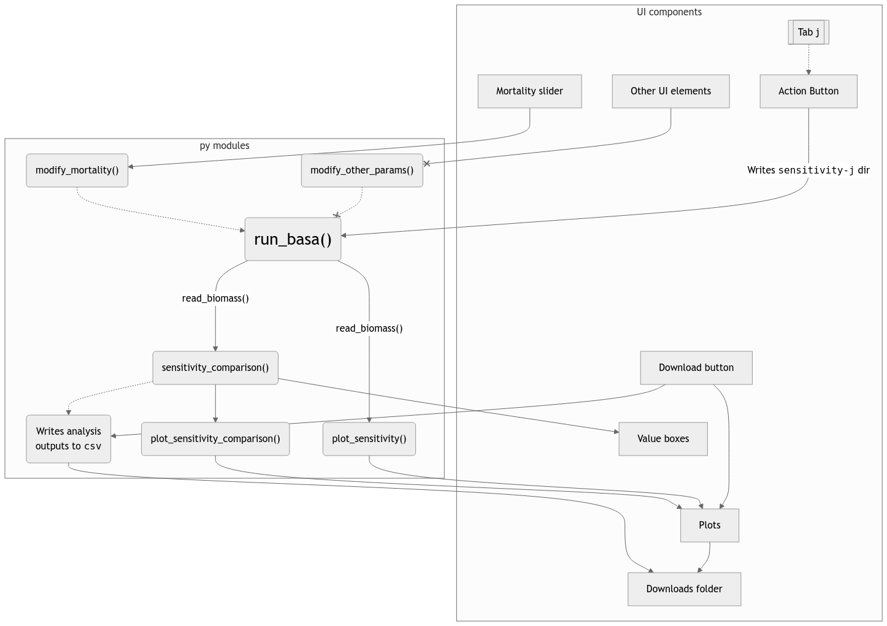

## User stories

### User type 1 - PhD Student, "technician user"

#### CL Roberts

CL is a PhD student who will be the primary user of the project. He will use the sensitivity tool to inform aspects of his dissertation. He needs clear outputs from the tool to inform how BASA may be improved. He has a high technical skill level. CL will be the primary person to service this tool.

### User type 2 - Faculty

#### Trevor Branch

Trevor Branch is CL's PhD supervisor. He will use the sensitivity tool to inform aspects of his dissertation.


### User type 3 - Ecosystem researchers in Prince William Sound

The third type of user of this tool includes miscellaneous researchers in Prince William Sound - zooplankton, marine mammal, sea bird scientists, etc. - who use the herring model for their own studies. This user base will be able to use the tool to inform how various model assumptions may affect conclusions from their own research. They will need the sensitivity tool to be extensible to parameters that are most relevant to their research (i.e., model assumptions about herring reproduction will be relevant to pink salmon studies because pink salmon predate larval herring). This group may or may not be technical, but they have expert-level knowledge in their respective domains.

Mary studies humpback whales in Prince William Sound, where herring are a major food source for humpback whales. She wants to learn more about herring population for her research on humpback whales, and to assess how sensitive the model is to error to see how the food source for humpback whales may change. Mary wants to be able to see the biomass of herring without having to sort through too much data on her own. Mary has high technical skills but wants to be able to use the model with minimal effort.

James studies plankton in Prince William Sound, which is a major food source for herring. He wants to know more about the BASA models sensitivity for results regarding herring biomass to understand how these changes might affect plankton dynamics. James has intermediate to high technical skills but prefers a more intuitive interface to enable him to explore the data easily. 

Kiersten studies pink salmon in Prince William Sound, an ecological competitor of herring. She is particularly interested in how assumptions about herring influence biomass predictions to inform her understanding of competition dynamics. Kiersten has advanced technical skills and wants a flexible tool so she can run tailored sensitivity analyses. She also wants to be able to compare her results.

### User type 4 - Board members of agency funding model development

Sylvia serves as a board member for the agency funding the model's development as a member from the general public. As a board member, she wants to know how accurate the model is so she can best represent the best interests of the community. She has limited technical knowledge and values clear, accessible explanations and figures for the data.

Nancy serves as a board member for the agency funding the model's development. She wants to understand how accurate the model is to ensure the interests of commercial fishing are best represented. She wants a tool that will allow her to see how changes in variables affect the predictions with little effort on her part. Nancy has low to intermediate technical skills.

Bob serves as a board member for the agency funding the model's development. He wants to know how accurate the model is so he can best represent sustenance fishers. Bob wants a tool that simplifies the complex analyses down to laymans terms and clearly shows the sensitivity. Bob has low technical skills. 

### User type 5 - General public

Thomas is a fisherman in the Prince William Sound area. He is curious about how fishing populations would change 
if certain conditions were met (e.g. birth rates were higher or lower, if he made the decision to throw back older fish). 
He is very familiar with fishing terms, but not familiar at all with statistics terms (e.g. standard deviation, residuals). 
He has average tech literacy and he prefers a straight forward term as opposed to something with all the bells and whistles. 

Kerry is a 10th grade student living near the Prince William Sound area. He stumbled upon this as a random web app 
and is just curious to play around with it. He’s not familiar with fishing terms or statistics terms, 
but has a fairly high tech literacy. He won’t spend a lot of time using the web-app but is curious to 
play with it for a few minutes.

Lily is a college student studying ecology. She is working on a class project on overfishing. 
She would like to use the web-app to generate some hypothetical scenarios to include in her class project. 
She has high tech literacy, is fairly familiar with statistics terms, and a little bit familiar with fishing terms. 
It’s important that she can compare different sensitivity runs. 

## Use Cases

#### Explicit use case
- To generate the adjusted model output from the base data and a user-specified mortality value
- To generate a data series of residuals between base data and adjusted data
- To explore the difference between base model output and adjusted model output graphically, using a plot of time on the x axis and residuals between base data and adjusted data on the y axis (Plot A)
- To explore the difference between base model output and adjusted model output graphically, using a plot of time on the x axis and percent difference between base data and adjusted data on the y axis (Plot B)
- To visualize Plot A and Plot B side-by-side
- To generate analysis values from the base data and the adjusted model output, specifically root mean squared error (RMSE) and mean absolute error (MAE) to evaluate residuals
- To generate analysis values from the base data and the adjusted model output, specifically R^2 to evaluate how much of the adjusted model output variation can be explained by the original data, and therefore understand how much the adjusted model dataset is affected by the changing mortality value
- To export the adjusted model output and residual data
- To export image files for Plot A and Plot B
- To save a previous model run inside the app

#### Implied use case

- Run the model every year using the annually updated dataset


## Components - Python modules

### Module 1: `run_basa.py`

#### Executes the model and returns clean output data

This function will just be a wrapper that takes no arguments and executes that 
following shell commands:

```
Rscript run_basa.r
Rscript plotting/plot_management_outputs.r
```

This [stackoverflow thread](https://stackoverflow.com/questions/19894365/running-r-script-from-python)
may be relevant. 

I think that `run_basa()` should create a new directory (e.g. `data_outputs/sensitivity_1`) 
when executed and copy the sensitivity outputs to that directory. That way we can
do multiple sensitivity runs and cache the results of earlier runs. 

**Important note:** for some unusual values of assumed natural mortality, the model 
will fail to converge. This module should be able to identify when this is the case
and clearly communicate it to the user. It will probably need to run the commands
above in a `try` block. Perhaps this module should return a `0` if the model 
converges and a `1` otherwise? The test for this module should include a edge 
test that ensures the model run fails gracefully if it cannot fit to the mortality 
values it is given.  


### Module 2: `modify_mortality.py`

#### changes assumed rate of natural mortality in model

This module is makes the key changes to the model assumptions which provide 
the basis for our sensitivity analysis. Despite its importance, its scope will be 
very narrow and hopefully easy to implement. The natural mortality assumption
gets fed into the model via the file `model/PWS_ASA(par).ctl`. Note that a `.ctl`
file is basically a `.txt` file that ADMB uses to control model execution (we call
it a "control" file). Lines 12-19 in `model/PWS_ASA(par).ctl` look like this:

```
## —————————————————————————————————————————————————————————————————————————— ##
##  init   lower   upper    est  prior                fun                     ##
## value   bound   bound    phz   type     p1    p2  type   # PARAMETER       ##
## —————————————————————————————————————————————————————————————————————————— ##
    0.08    0.00    5.00      3      0      0     0     0   # 1:  VHSV_age3_4_mort_93
    0.22    0.00    5.00      3      0      0     0     0   # 2:  ICH_age5_8_mort_93
    0.25    0.05    1.50     -2      0      0     0     0   # 3:  Z_0_8
    0.93    0.30    1.60      2      0      0     0     0   # 4:  Z_9
```

The natural mortality parameter we want to modify is called `Z_0_8` in the model.
Note that I'm using $M$ to denote this parameter but the model calls it `Z_0_8`.
The other parameters shown above are other mortality parameters that are estimated
and we don't need to touch them. In the `est phz` column in the table above, a $-$
sign denotes a "fixed" parameter, so this control file is telling the model to 
fix $M$ at 0.25. 

So, we want `modify_mortality.py` to take `model/PWS_ASA(par).ctl` and a new value
for `Z_0_8` as inputs, correctly identify the $M =  0.25$ in the table above and 
change it to the new value, then write over `model/PWS_ASA(par).ctl` with the alteration.

#### A note on natural mortality:

In fisheries population models, natural mortality refers to the instantaneous 
background rate of death in the stock and is generally denoted $M$. We usually 
estimate or define $M$ for specific years ($M_t$) and can re-express it as an 
annual survival fraction, $S_t$, which gives the proportion of fish
that survived year $t$:

$$ S_t = e^{-M_t} $$

In BASA, $M_t$ is constant over time so the subscript is not relevant to us.
Since $S_t$ is a proportion, the $M_t$ is only valid for $M_t \in [0, \infty)$. 
So we should probably raise a `valueError` if `modify_mortality()` receives a 
negative number, but in practice the range of values for $M$ that users will be 
able to choose in the shiny app will be much narrower than $[0, \infty)$.

### Module 3. `read_biomass.py`

#### wrappers to read biomass estimates from `.csv`

This module should create two functions:

`read_biomass_base()`: takes no input, reads `data_outputs/outputs-for-management_base.csv`
and saves it to a pandas DataFrame.

`read_biomass_sensitivity()`: takes a directory input created by `run_basa()` that 
points to a particular sensitivity run (e.g. `data_outputs/sensitivity_1`), 
reads `outputs-for-management.csv` and saves to a pandas DataFrame. 

### Module 4. `plot_sensitivity.py`

#### plots sensitivity model biomass time series alongside base model biomass

This module will create a function that takes a directory input created by 
`run_basa()` that points to a particular sensitivity run (e.g. 
`data_outputs/sensitivity_1`) and use it to call `read_biomass_sensitivity()`.
Then it will call `read_biomass_base()` and plot both time series with
different colors and a legend. `plot_sensitivity()` will either return the plot or 
save it to a file (not sure which would be better).

### Module 5. `sensitivity_comparison.py`

#### calculates percent error (or any other relevant metric) between base and sensitivity biomass and reports summary statistics

This module will create a function which calls `read_biomass_sensitivity()` and
`read_biomass_base()` and calculate a percent error (or some other metric) between 
base and sensitivity biomass 
for each year in the model time series. It will take a directory input pointing 
to a particular sensitivity run (e.g. `data_outputs/sensitivity_1`) and returns
some summary statistics (such as mean percent error, mean absolute percent error, 
mins and maxs, etc.). As a side effect, this function will write the error metrics 
to a file (e.g. `data_outputs/sensitivity_1/sensitivity_comparison.csv`).

### Module 6. `plot_sensitivity_comparison.py` 

#### plots percent error between base and sensitivity biomass by year

This module will create a function which creates a time series plot of the error 
metrics written by `plot_sensitivity_comparison()`. It will take a directory input
(e.g. `data_outputs/sensitivity_1`), read `sensitivity_comparison.csv` in that 
directory, and either return a plot or save it to a file. It should probably test 
if the directory input and file exist and, if not, call `sensitivity_comparison()`.

## Components - UI elements

#### Natural mortality slider bar input

This will be a slider with valid minimum and maximum values of natural mortality. It should contain some values for with BASA does not converge.

#### Natural mortality number box input

This is a redundant feature to directly input some value of natural mortality (sometimes sliders are hard to select a specific value). It should throw an error for an invalid value of natural mortality (negative numbers). If used, this input should take precedence over the slider.

#### Other buttons/sliders/etc. for other parameters as place holders

For extensibility, create some other UI elements as place holders to conduct sensitivity analyses for other parameters.

#### Boxes to report error metric summary statistics

Just a few boxes that report summary statistics from sensitivity analysis that are obvious from a quick glance

#### Box to show sensitivity/base biomass time series plot

Place to show the first plot

#### Box to show error time series plot

Place to show the second plot. Not sure if plots will be side-by-side or stacked

#### Tabs to create multiple sensitivity runs

The app should initialize with a single tab, and a button should reveal recursively more tabs for more sensitivity runs.

#### Action button to initiate sensitivity analysis

Once a value for natural mortality is selected, the action button executes the model run.

#### Download button to obtain sensitivity results

This button will place plots and a `csv` of results in the users downloads folder.

## Design

The following flow chart describes the relationship between UI components and 
`python` modules. Solid lines represent a direct causal relationship between
components. For example, a function call or necessary consequence of `shiny`'s 
reactivity. In contrast, dashed lines represent indirect relationships such as
a function call side effect or optional parameter. X's on arrow heads denote features that are not implemented.


